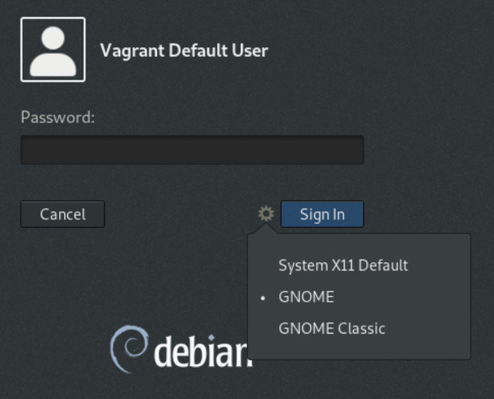

# ansible-x0-vnc

[](https://github.com/nfaction/ansible-x0-vnc/actions/workflows/molecule.yml)

Role to install and configure X0 VNC Server

## Usage

## Wayland Notes

By default `Wayland` is enabled by default. This is a problem as it causes issues with VNC sessions to display `:0`.

In order to allow `X0` or `:0` access, one must disable `Wayland` AND select `Gnome Xorg` OR `Gnome` once `Wayland` has been disabled.

If you see something like this when running a VNC server manually, `Wayland` is likely still enabled.

``` bash
$ x11vnc -forever -rfbauth /home/vagrant/.vnc/passwd
01/08/2019 07:04:21 passing arg to libvncserver: -rfbauth
01/08/2019 07:04:21 passing arg to libvncserver: /home/vagrant/.vnc/passwd
01/08/2019 07:04:21 x11vnc version: 0.9.13 lastmod: 2011-08-10  pid: 5088
01/08/2019 07:04:21 XOpenDisplay("") failed.
01/08/2019 07:04:21 Trying again with XAUTHLOCALHOSTNAME=localhost ...
01/08/2019 07:04:21
01/08/2019 07:04:21 *** XOpenDisplay failed. No -display or DISPLAY.
01/08/2019 07:04:21 *** Trying ":0" in 4 seconds.  Press Ctrl-C to abort.
01/08/2019 07:04:21 *** 1 2 3 4
No protocol specified
01/08/2019 07:04:25 XOpenDisplay(":0") failed.
01/08/2019 07:04:25 Trying again with XAUTHLOCALHOSTNAME=localhost ...
No protocol specified
01/08/2019 07:04:25 XOpenDisplay(":0") failed.
01/08/2019 07:04:25 Trying again with unset XAUTHLOCALHOSTNAME ...
No protocol specified
01/08/2019 07:04:25

01/08/2019 07:04:25 ***************************************
01/08/2019 07:04:25 *** XOpenDisplay failed (:0)

*** x11vnc was unable to open the X DISPLAY: ":0", it cannot continue.
*** There may be "Xlib:" error messages above with details about the failure.
```

Reboot your machine and check to see if `vnc` is running:

``` bash
# systemctl status vnc
● vnc.service - Remote desktop service (VNC)
   Loaded: loaded (/etc/systemd/system/vnc.service; enabled; vendor preset: enabled)
   Active: active (running) since Thu 2019-08-01 07:11:57 GMT; 11s ago
  Process: 482 ExecStart=/bin/bash -c x11vnc -forever -rfbauth /home/vagrant/.vnc/passwd & (code=exited, status=0/SUCCESS)
 Main PID: 485 (x11vnc)
    Tasks: 1 (limit: 1138)
   Memory: 7.4M
   CGroup: /system.slice/vnc.service
           └─485 x11vnc -forever -rfbauth /home/vagrant/.vnc/passwd

Aug 01 07:11:57 buster systemd[1]: Starting Remote desktop service (VNC)...
Aug 01 07:11:57 buster systemd[1]: Started Remote desktop service (VNC).
```

Login with this option (Select `Gnome` or `Gnome Xorg`):


